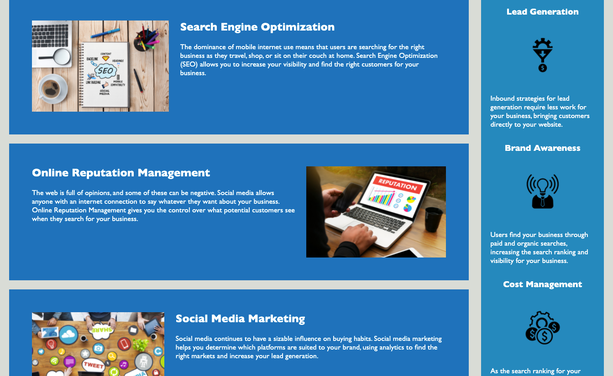
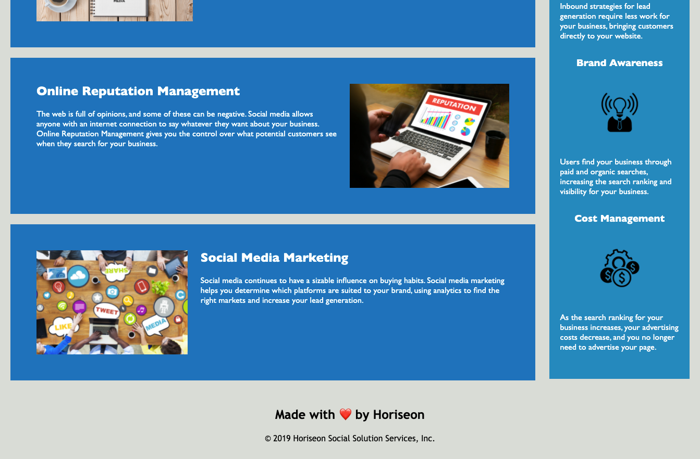

# 01 HTML, CSS, and Git: Code Refactor
## 01-HTML-Git-CSS-Homework
 

This project was created for The Ohio State University's Coding Bootcamp in 2021.

## Description
The client needed an accessible and search engine optimized codebase for their website.  The client wanted:
- Semantic HTML elements
- Elements follow a logical structure
- Alt attributes on images
- Headings in sequential order
- Page Title
## Skills Learned
- [HTML/CSS](https://www.w3.org/standards/webdesign/htmlcss)
- [Semantic HTML](https://developer.mozilla.org/en-US/docs/Learn/Accessibility/HTML)
- [Debugging](https://docs.microsoft.com/en-us/visualstudio/debugger/debugging-absolute-beginners?view=vs-2019&tabs=csharp)
- [Refactoring](https://www.altexsoft.com/blog/engineering/code-refactoring-best-practices-when-and-when-not-to-do-it/#:~:text=Code%20refactoring%20is%20a%20process,code%20more%20efficient%20and%20maintainable.)
## Project Deployment
[GitHub Pages](https://ethanharsh.github.io/01-HTML-Git-CSS-Homework/)
---
